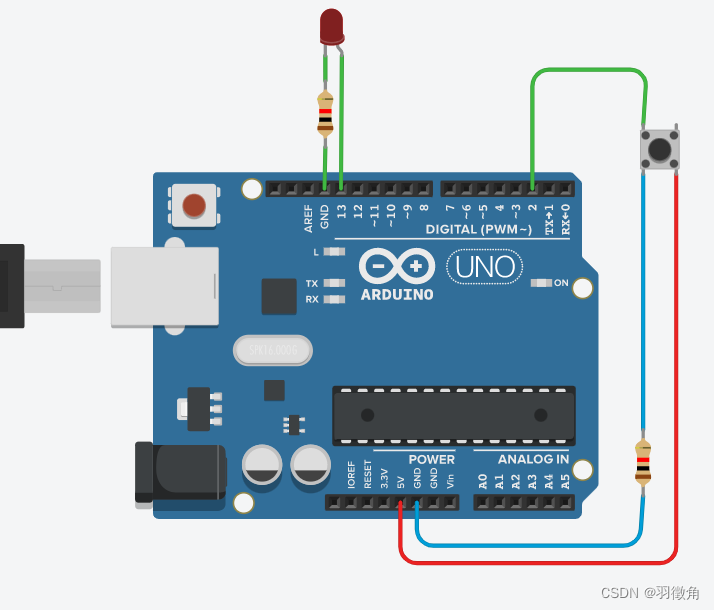
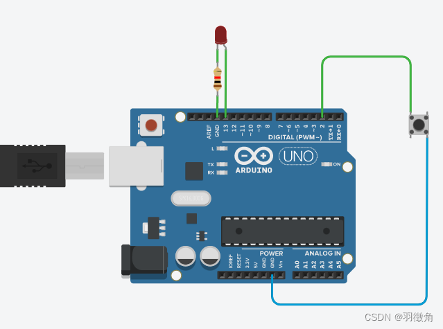
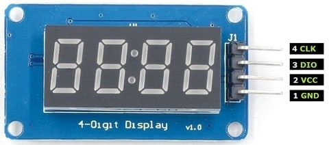
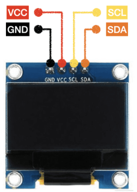
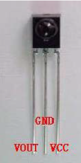

# 按钮

## 参考

[Arduino从零开始(1)——按钮控制LED_arduino按钮怎么接线_羽徵角的博客-CSDN博客](https://blog.csdn.net/lylelo/article/details/127851823)

[Arduino入门：按钮升级（按一下按钮，LED亮，再按一下，LED熄灭）_Dr.勿忘的博客-CSDN博客_arduino按一下亮再按一下灭](https://blog.csdn.net/foolbirdM/article/details/112753789)

## 概述

如果Arduino在读取开关信号时不接上拉或下拉电阻，那么其误动作的概率就很大。Arduino本身有自带上拉电阻，所以实际使用过程中更推荐使用上拉模式来读取开关信号。

电路中上下拉电阻的作用：

* 上拉电阻——是将不确定信号通过一个电阻钳位在高电平，电阻同时限流作用
* 下拉电阻——是将不确定信号通过一个电阻钳位在低电平

## 下拉模式



代码

```c
void setup()
{
	pinMode(13,OUTPUT);
	pinMode(2,INPUT);
	digitalWrite(13,LOW);
}

void loop()
{
	//按下开关，则点亮LED灯
	if(digitalRead(2)==HIGH) //读取2号引脚状态，即开关的状态
	{
		digitalWrite(13,HIGH);
	}
}
```

## 上拉模式

Arduino本身有自带上拉电阻，所以不用外接上拉电阻。



代码

```c
void setup()
{
	pinMode(13,OUTPUT);
	pinMode(2,INPUT_PULLUP);
	digitalWrite(13,LOW);
}

void loop()
{
	//按下开关，则点亮LED灯
	if(digitalRead(2)==LOW) //读取2号引脚状态，即开关的状态
	{
		digitalWrite(13,HIGH);
	}
}
```


# 舵机（servo motor）

## 参考

[Arduino Uno 实验7——SG90舵机_惺忪牛犊子的博客-CSDN博客_arduino sg90](https://blog.csdn.net/weixin_42645653/article/details/112210095?spm=1001.2101.3001.6650.6&utm_medium=distribute.pc_relevant.none-task-blog-2%7Edefault%7ECTRLIST%7ERate-6-112210095-blog-121828224.pc_relevant_aa2&depth_1-utm_source=distribute.pc_relevant.none-task-blog-2%7Edefault%7ECTRLIST%7ERate-6-112210095-blog-121828224.pc_relevant_aa2&utm_relevant_index=13)

[Arduino控制舵机详解（含代码）_项目申报小狂人的博客-CSDN博客](https://blog.csdn.net/m0_58857684/article/details/125740665?spm=1001.2101.3001.6650.6&utm_medium=distribute.pc_relevant.none-task-blog-2%7Edefault%7EBlogCommendFromBaidu%7ERate-6-125740665-blog-121485119.pc_relevant_multi_platform_whitelistv3&depth_1-utm_source=distribute.pc_relevant.none-task-blog-2%7Edefault%7EBlogCommendFromBaidu%7ERate-6-125740665-blog-121485119.pc_relevant_multi_platform_whitelistv3&utm_relevant_index=7)

[（1）arduino控制舵机缓慢旋转90°_工大小蒋的博客-CSDN博客_舵机转动代码](https://blog.csdn.net/jianghaoran1/article/details/121828224)

[【Arduino百问】舵机？你懂舵机吗？三分钟深入了解舵机 更精准的控制_哔哩哔哩_bilibili](https://www.bilibili.com/video/BV15X4y157ay/?vd_source=2e3cc2431683dc5e776b0341cced04ba)

[180度\360度sg90舵机的使用及代码程序 (shuzhiduo.com)](https://www.shuzhiduo.com/A/pRdBDrn6Jn/)

## 概述

舵机是一种 **位置（角度）伺服的驱动器** ，适用于那些需要角度不断变化并可以保持的控制系统。主要是 **由外壳、电路板、驱动马达（直流电机）、减速齿轮组、位置检测元件（控制电路）所构成** ，是一套 **自动（闭环）控制装置** 。

舵机一般有：

- 180°舵机/270°舵机 - 可以控制角度
- 360°舵机 - 可以控制正反转和转速

## 接线

* 棕色：GND线
* 红色：5V电源线
* 橙色：信号线 （示例接9脚）

## 控制原理简述

舵机内部有一个基准电压，微处理器产生的PWM信号通过信号线进入舵机产生直流偏置电压，与舵机内部的基准电压作比较，获得电压差输出。电压差的正负输出到电机驱动芯片上，从而决定正反转。当舵机开始旋转的时候，舵机内部通过级联减速齿轮带动电位器旋转，使得电压差为零，电机停止转动。

### 180°舵机

控制线用于传输角度控制信号。这个角度是由控制信号脉冲的持续时间决定的，这叫做脉冲编码调制（PCM）。舵机的控制一般需要一个20ms左右的时基脉冲，该脉冲的高电平部分一般为0.5ms-2.5ms范围，总间隔为2ms。脉冲的宽度将决定马达转动的距离。

| 脉冲宽度 | 180°舵机旋转角度 | 270°舵机旋转角度 |
| -------- | ----------------- | ----------------- |
| 0.5ms    | 0                 | 0                 |
| 1ms      | 45                | 67.5              |
| 1.5ms    | 90                | 135               |
| 2ms      | 135               | 202.5             |
| 2.5ms    | 180               | 270               |

### 360°舵机

360度舵机是只能够控制方向和旋转转速，所以360度舵机给定一个PWM，会以特定的速度和方向转动。

| 脉冲宽度 | 舵机转动     |
| -------- | ------------ |
| 0.5ms    | 正向最大转速 |
| 1.5ms    | 速度为0      |
| 2.5ms    | 反向最大转速 |

## 库及常用函数

#include <Servo.h>

常用函数

- attach() : 定义舵机的控制引脚
- write() : 将一个角度值写入舵机
- read() : 读取舵机当前的角度
- writeMicroseconds() : 通过脉冲宽度控制马达

## 示例代码

```c
#include<Servo.h> //加载servo控制库

Servo myservo;	//创建实例
int val = 0;
int inputSignal = A0;	//设置电位器的连接引脚为A0

void setup()
{
  myservo.attach(9,500,2500);	//绑定舵机的控制引脚为9，同时修正脉冲宽度
  Serial.begin(9600);
}

void loop()
{
  val = analogRead(inputSignal);
  val = map(val,0,1023,0,180);
  myservo.write(val);		//将转动角度写入舵机
  delay(15);
  Serial.print(myservo.read());
}

```

## 注意事项

马达的5V要与其他控制元件的5V分开（选取UNO板上的不同5V接口），避免马达噪音带来的干扰，尤其是对红外遥控的干扰。


# TM1637 LED display

## 参考

[如何基于Arduino使用TM1637四位七段数码管显示模块 - Arduino专区 - 一板网电子技术论坛 (yiboard.com)](https://www.yiboard.com/thread-1713-1-1.html)

## 接线



| 引脚 | 定义                 |
| ---- | -------------------- |
| GND  | 接地                 |
| VCC  | 电源+                |
| DIO  | 数据输入/输出 （A2） |
| CLK  | 时钟输入（A3）       |

## 库及常用函数

#include <TM1637Display.h>

常用函数

* setSegments() - 设置每个数字段的原始值
* showNumberDec() - 显示一个十进制数

* showNumberDecEx() – 显示带小数点或冒号的十进制数
* setBrightness() - 设置显示器的亮度

* clear() - 清空显示内容


# I2C LCD display

## 参考

[Arduino Uno 点亮OLED屏幕(SSD1306,4PIN,IIC) – 凌顺实验室 (lingshunlab.com)](https://lingshunlab.com/book/arduino/arduino-uno-use-loed-display-i2c-ssd1306)

[Arduino下使用SSD1306驱动的OLED - 简书 (jianshu.com)](https://www.jianshu.com/p/1b77a1550f15)

[Arduino-LiquidCrystal_I2C 液晶库 - 天子骄龙 - 博客园 (cnblogs.com)](https://www.cnblogs.com/liming19680104/p/10933111.html)

## 接线



| 引脚 | 定义              |
| ---- | ----------------- |
| GND  | 电源地            |
| VCC  | 电源正            |
| SCL  | 时钟 （示例接A5） |
| SDA  | 数据 （示例接A4） |

## 库及常用函数

#include <LiquidCrystal_I2C.h>

常用函数

* lcd.init() - lcd初始化
* setCursor(x,y) - 设置起始坐标 (参数1:列, 参数2:行)
* lcd.print() - 显示内容
* lcd.clear() - 清空显示屏
* lcd.backlight() - 开启lcd背光灯

## 示例代码

```c
#include <Wire.h>  //LiquidCrystal_I2C库需要要用该库
#include <LiquidCrystal_I2C.h>  //导入液晶屏库


LiquidCrystal_I2C mylcd(0x27,16,2);  //创建液晶屏对象
//参数1  液晶屏地址
//参数2和参数3   2行16列
void setup() {
  mylcd.init();//初始化
  mylcd.backlight(); //开启lcd背光灯

}

void loop() {
   mylcd.setCursor(0, 0); //设置光标
  mylcd.print("hello");//输出内容
  mylcd.setCursor(0, 1);
  mylcd.print("lm");
  delay(1000);

}
```

# IR红外遥控

## 参考

[IRremote库 – 太极创客 (taichi-maker.com)](http://www.taichi-maker.com/homepage/reference-index/arduino-library-index/irremote-library/)

[arduino 红外遥控器控制LED灯 - MarcoReus - 博客园 (cnblogs.com)](https://www.cnblogs.com/Westfalen/p/5829248.html)

[Arduino-IRremote/Arduino-IRremote: Infrared remote library for Arduino: send and receive infrared signals with multiple protocols (github.com)](https://github.com/Arduino-IRremote/Arduino-IRremote)

## 红外接收器接线



例如：VOUT接7脚

## 库及常用函数

#include <IRremote.h>

注意：2.x版本代码和3.x以上代码使用上不太一样

## 示例代码

2.x版本库

```c
#include <IRremote.h>

IRrecv irrecv(RECV_PIN);
decode_results results;

void setup()
{
...
  irrecv.enableIRIn(); // Start the receiver
}

void loop() {
  if (irrecv.decode(&results)) {
      Serial.println(results.value, HEX);
      ...
      irrecv.resume(); // Receive the next value
  }
  ...
}
```

3.x / 4.x 版本库

```c
#include <IRremote.hpp>

void setup()
{
...
  IrReceiver.begin(IR_RECEIVE_PIN, ENABLE_LED_FEEDBACK); // Start the receiver
}

void loop() {
  if (IrReceiver.decode()) {
      Serial.println(IrReceiver.decodedIRData.decodedRawData, HEX); // Print "old" raw data
      /* USE NEW 3.x FUNCTIONS */
      IrReceiver.printIRResultShort(&Serial); // Print complete received data in one line
      IrReceiver.printIRSendUsage(&Serial);   // Print the statement required to send this data
      ...
      IrReceiver.resume(); // Enable receiving of the next value
  }
  ...
}
```
